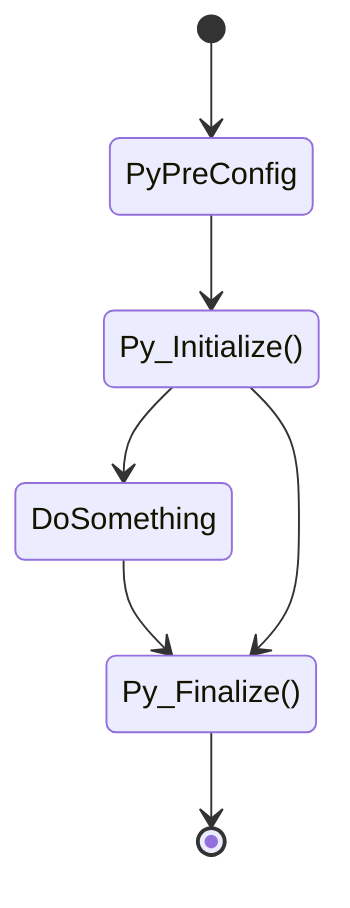

## 왜 Python 모듈을 C언어에서 쓰는가

Python은 기본적으로 C언어를 기반으로 인터프리터가 만들어져있고, 모든 데이터 구조가 C언어로 구조화 되어있다. 그래서 C언어 위에서 에뮬레이트되어 돌아가는 Python은 태생적으로 동작 속도에 한계가 있다. 그럼에도 불구하고 우리는 Python에 너무나 잘 구현되어있는 모듈을 C언어에서 쓰고싶을 때가 있을지 모른다. 라고 하는 현실적인 문제가 발생해서 작업을 해봤다.

이 문서는 그 중에서 C언어에서 최초로 Python 환경을 초기화 하는 과정을 기록하려 한다.

## 코드 구현

### 전체적인 구성

Python의 뒷면은 전체적으로 이런 구성으로 되어있다.



이 중에서 `Py_Initialize()`와 `Py_Finalize()` 함수를 타깃으로 한다.

### C++ 에서

C++에서는 이 모든 과정을 객체화해서 메모리에서 좀 더 안전하게 관리를 해볼 수 있었다. 그래서 이걸 구현하면 이런 형태의 코드를 만들 수 있다.

```c++
#include <Python.h>

class PythonEnv {
    public:
        PythonEnv();
        ~PythonEnv();
};

PythonEnv::PythonEnv() {
    Py_Initialize();

    if (!Py_IsInitialize()) {
        throw std::runtime_error("Python environment does not initialized.");
    }
}

PythonEnv::~PythonEnv() {
    Py_Finalize();
}
```

여기에서 사용한 Python3과 관련된 인터페이스 함수들에대해 알아보자.

#### Py_Initialize

우선은 간단하게 `Py_Initialize`함수를 이야기한다면, 이 함수는 Python3 Interpreter를 메모리에 올려서 Python3에서 사용하는 데이터구조, 함수 등을 C/C++언어 프로그램에서 사용할 수 있게 초기화 하는 함수이다. 이 이후로 Python3으로 구현되어있는 모듈들도 Import할 수 있고, 다른 것들도 다 할 수 있게된다.

이 때 초기화 되는 환경은 Global로 사용되는 Python3이다. 이 위치는 Linux를 기준으로 `/usr/local/bin`이 되고, 이 경로를 기준으로 패키지 경로를 탐색한다. 이 때의 패키지 경로는 `/usr/lib/python3/dist-packages/`가 된다.

만약 pyenv를 사용하고있다면, 이 경로는 `$HOME/.pyenv/versions/python3.x/lib/python3.x/site-packages`이기 때문에 잘 확인해야 한다.

이 `Py_Initialize` 함수에는 다른 버전도 있는데, `Py_InitializeEx` 함수가 있다. 이 함수에서는 파라미터로 integer 타입 값을 받는데, 이 값이 1인 경우에 `Py_Initialze`를 수행하고 그렇지 않은 경우에는 무시하게된다.

함수 호출의 성공여부는 `Py_IsInitialized` 함수를 이용해서 알 수 있는데, 정상적으로 초기화되었을 경우 `true`, 그렇지 않은 경우 `false`를 반환하기 때문에 그것을 이용해서 처리를 할 수 있다.

#### Py_Finalize

이 함수는 위에서 `Py_Initialize` 함수로 초기화한 인터프리터 환경을 초기화하는 함수이다. 이 전에 Python3 interpreter 위에서 했던 모든 작업들을 메모리에서 제거하는 작업인데, 주의해야 할 점은 일부 모듈의 경우 CPython, Cython 등의 API를 이용해서 만든 모듈 등은 메모리가 전부 해제되지 않기 때문에 신경써서 처리해줘야 할 것들이라고 할 수 있다.

## 결론

자세하게 쓰면 쓸수록 Python3의 C-API 문서를 보는게 그냥 더 빠를 정도가 되어서 그정도로는 쓰지 않았지만, 이 앞에서 Configuration 등의 단계가 있다. 나중에 추가로 문서화해보기로 한다.
