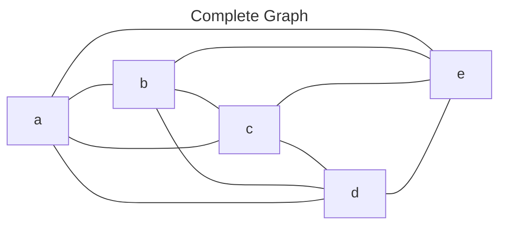
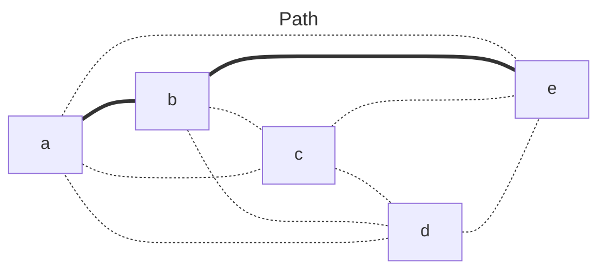
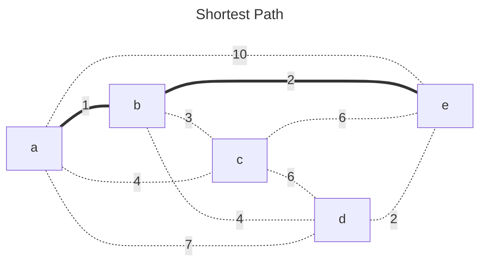
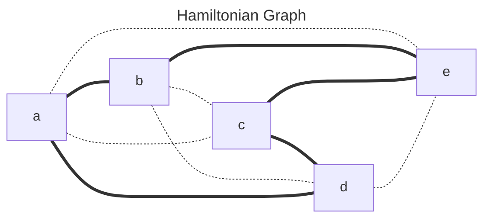
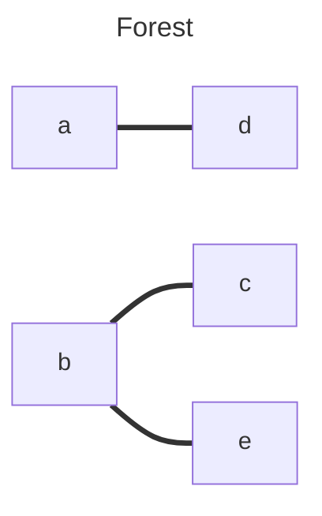
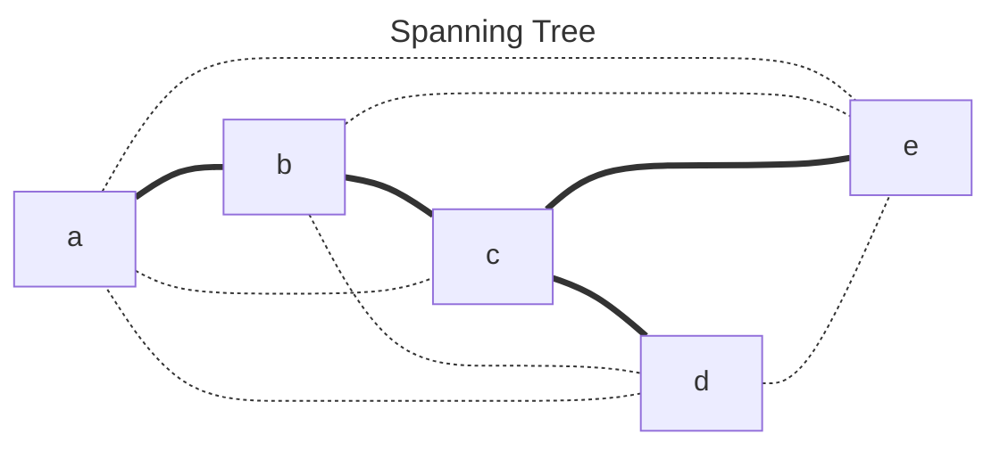
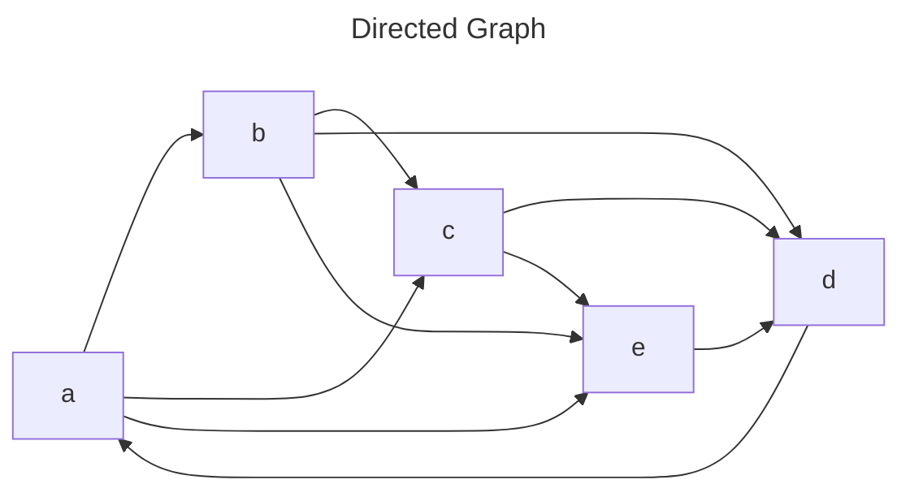
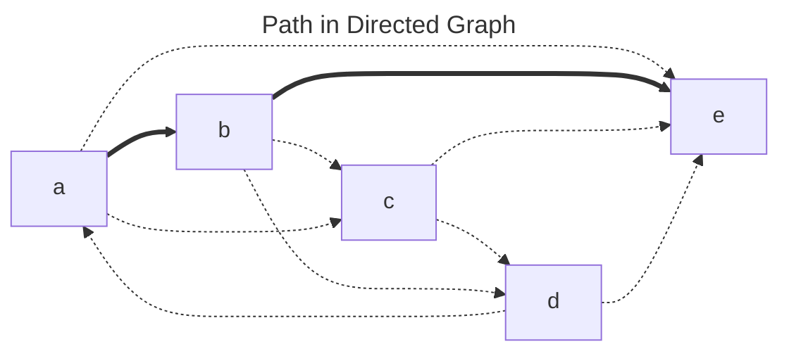
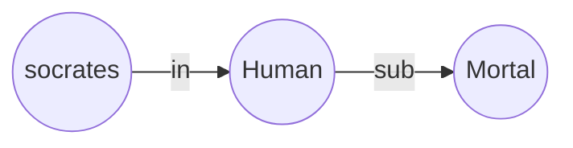
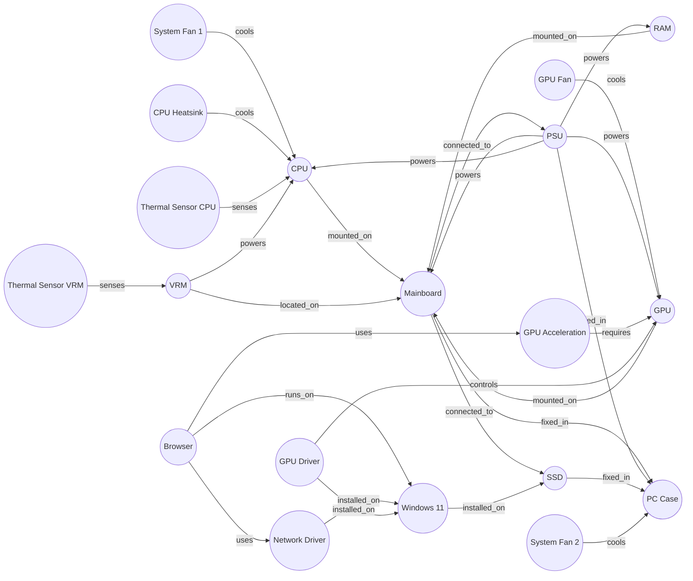

## 도입

이전에 작성했던 포스트에서 Knowledge Base를 Set theory를 바탕으로 이해해봤다. 하지만 지식은 단순히 위계로만 표현되지 않고, 수평적인 관계도 갖고있다. 이번 문서에서는 Knowledge Base를 Graph라는 수학 모델을 통해 표현했을 때 어떤 장점이 있고, 구조적으로 어떻게 지식이 표현되게 되는지, 지식간의 관계가 어떻게 표현되는지를 정리해보려고 한다.

## Knowledge Graph에 대해서

Knowledge Graph를 간단하게 말하면 Graph로 표현한 Knowledge Base일 것이다. Graph로 표현한다는 점이 중요한데, Graph는 개별로만 존재하던, 아니면 관계가 잘 드러나지 않던 지식들을 Edge라는 연결을 통해 직접적으로 표현한다는 것을 의미하기 때문이다. 우선은 Knowledge Graph의 바탕이 되는 Graph theory를 좀 정리한 뒤 Knowledge Base를 함께 정리해보려 한다.

### Graph에 대해서

최대한 압축해서 Graph를 먼저 정리해놓은 후 Knowledge Graph에 대해 다루면 참고하기 수월할 것 같아서, 이산수학에서 다루는 Graph에 대해서, 그리고 다양한 용어들을 간단히 정리해보려 한다.

$$
\begin{array}{ll}
    &G = (V, E) \\
    &V = \{v_1, v_2, v_3, ...\} \\
    &E = \{(x, y) | x, y \in V\}
\end{array}
$$

위 수식은 Graph를 수학적인 정의로 표현해본 것이다. G는 집합 V와 집합 E의 쌍으로 정의된다. 아래는 이 Graph의 개념 정의와 다양한 Graph의 구조를 좀 나열해보았다.

#### Basic Terms

계속 활용되는 용어들을 먼저 정리해야 한다. 아래는 용어와 의미를 함께 나열한 목록이다.

* Node: 데이터 구조 관점에 Graph의 정점을 가리키는 용어이다. Graph theory에서의 Vertex와 유사한 단어지만, Knowledge Graph에서는 데이터를 다루는 최소 단위의 의미도 있다.
* Edge: 두 Node 사이의 연결을 가리킨다.
* Degree: 어떤 Node가 다른 Node와 연결되는 Edge의 수를 말한다.
* Distance: 어떤 Node에서 다른 Node까지 그 사이에 있는 Edge의 집합을 중에서, 크기가 최소인 집합의 크기를 가리킨다.

이 용어들을 활용해서 다양한 개념을 정리할 것이다.

#### Complete Graph

정점의 집합을 N, 정점 사이의 간선의 집합을 E라고 쓰면,

$$
\begin{array}{ll}
    \forall n \in N,\\
    E = \{(n, m) | m \in N \text{ and } n \neq m\}
\end{array}
$$

이렇게 Graph를 구성하는 E가 자기 자신을 제외한 모든 정점을 연결하는 선의 집합이라면, G는 Complete graph라고 한다. 예를들어 이런 Graph를 그려볼 수 있다.

#### Path

Graph에서 정점들을 연결하다보면 어떤 점에서 다른 점까지 하나 이상의 선으로 연결할 수 있는데, 이 연결 중에서 정점을 한번씩만 지나도록 연결한 것을 Path라고 한다.

위 그림만 봐도 Path가 하나만 있는게 아니다. 예를들어 a에서 e 사이에 있는 무수히 많은 Path 중에서 5개정도만 나열해도 이정도 된다.

$$
\begin{array}{ll}
    P_1 = \{(a, e)\}\\
    P_2 = \{(a, b), (b, e)\}\\
    P_3 = \{(a, c), (c, e)\}\\
    P_4 = \{(a, d), (d, e)\}\\
    P_5 = \{(a, b), (b, c), (c, e)\}\\
\end{array}
$$

다양한 조건이 있을 수 있지만, 이렇게 많은 Path 중에서 가장 짧은 Path를 찾는 알고리즘이 바로 Shortest Path Algorithm이다. 조건이 다양한 이유는, 단순히 Edge의 수가 가장 적은 Path일 수도 있지만, 모든 Edge에 weight이라고 하는 속성값이 주어진다면, 어떤 Path의 모든 Edge가 갖고있는 weight의 합이 최소인 Path가 Shortest Path가 될 수 있기 때문이다.

Distance가 기준이라면 `Path{(a, e)}`가 Shortest Path이지만, 이렇게 weight이 값으로 주어진다면 `Path{(a, b), (b, e)}`의 weigth이 3이기 때문에 이게 Shortest Path가 된다.

#### Loop(Cycle)

이 Path가 만약 하나 이상의 정점을 지나서 다시 시점으로 되돌아오도록 그려지면 이 Path를 포함한 Path를 Loop, Loop를 포함한 Graph를 Cycle Graph라고 한다. Cycle Graph 중에서 모든 정점을 포함하는 Loop를 만들 수 있다면 이 Graph는 Hamiltonian Graph라고 한다.

또한 비슷한 Graph 중에서, Edge 집합이 Graph의 Edge 집합과 같으면서 정점은 중복을 허용하는 Loop를 갖고있는 Graph를 Eulerian Graph라고 한다.

#### Tree

Graph에 Loop가 하나도 없다면, 이 Graph는 Tree라고 한다. Graph가 서로 연결되어있지 않은 Tree로 구성되어있다면, 이 Tree의 집합은 Forest라고 부른다.

위 Graph는 두 tree 사이에 연결이 없다. 그러나 만약 어떤 Graph에서 모든 정점을 포함한 tree를 만든다면, 이 tree는 Spanning tree라고 한다.

당연히 Spanning Tree도 이렇게 하나만 있는게 아닌데다가, 만약 Shortest Path처럼 모든 Edge에 weight 속성이 있는 경우, 모든 Spanning Tree 중에서 최솟값만으로 연결되어있는 것을 Minimum Spanning Tree라고 한다.

Tree는 일반적인 Graph와 다르게 Root라는 특수한 Node가 있다. 모든 Node는 Root로부터 거리를 Depth라고 정의한다. Tree도 중요한 구조이기 때문에 별도로 자세히 다뤄보면 좋을것 같다.

#### Directed Graph

지금까지 Graph는 전부 방향이 없는 Graph였는데, 모든 Edge가 시점과 종점으로 표현되면 이 Graph는 Directed Graph라고 한다.

Directed Graph에서도 물론 Path, Loop를 다룰 수 있다. 이 때 Path는 명확하게 Edge끼리 서로 종점과 시점이 같은 정점이어야 한다.

위 그림에서 `c -- d -- b`의 경우는 정점 d에서 두 Edge의 종점이 같기 때문에 Path가 될 수 없다.

## Knowledge Base를 Knowledge Graph로 표현

Knowledge Base를 Graph로 표현할 때는 Directed Graph로 표현한다. 일반적으로 자연어에서 두 지식간의 관계가 방향성을 띠고 있고 만약 이 관계가 상호관계로 표현될 수 있다면, 예를들어 고니와 백조 처럼 동의어 관계를 표현하려면 고니 --> 백조, 백조 --> 고니 이렇게 두개의 Edge로 표현한다.

이전 포스트에서 다뤘던 3단논법의 구조를 원래의 First-order logic으로 다시 쓰면 이렇게 쓸 수 있다.

$$
\begin{array}{ll}
    &&Human \subseteq Mortal &\text{(1)}\\
    &&Socrates \in Human  &\text{(2)}\\
    \cr
    &\therefore &Socrates \in Mortal &\text{(3)}\\
\end{array}
$$

여기서 Socrates는 Human 집합의 요소이고, Human은 Mortal의 부분 집합이다. 위의 단계는 어떤 집합 A가 집합 B의 부분집합이고, 어떤 요소 a가 집합 A에 속하면, 요소 a는 집합 B에도 속한다는 관계를 추론할 수 있음을 가리킨다. 다만 Knowledge Base에는 결론인 단계 3이 직접 표현되진 않는다. 이 Logic의 단계 1, 단계 2를 그래프 형태로 표현하게 되면 이렇게 그려진다.

이 Graph에서 Socrates가 Human으로, Human이 Mortal로 Directed edge로 연결되어있는 것을 볼 수 있다. 이렇게 Graph로 표현하면 `Socrates`에서 `Mortal`로 Path를 만들 수 있다는 것을 알 수 있다. 다만 이 Path가 `Socrates ∈ Mortal`라는 의미를 갖는지에 대해서는 어떤 Graph가 위와 같이 in과 sub라는 관계로 연결되는 패턴인 경우에 in이라는 관계로 정의할 수 있음을 추정할 수 있어야 한다.

## Knowledge Graph의 개념적 의미

Graph로 표현되는 Knowledge Base는 지식과의 관계까지 표현한다는 얘기를 반복하고 있는데, 지식간의 의미론적 관계가 어떻게 그래프로 변형되는지 그래프의 구조적 패턴으로 정리해보려고 한다. 

이런 Knowledge Graph가 있다고 가정하고 Knowledge Graph만의 유용함에 대해 파들어가보면 좋을것 같아 고민해보았다.

Knowledge Graph는 이 자체로는 어떤 역할을 하지 않는다. 이 Knowledge Graph이 포함되어있는 시스템에서 일부 구성요소들이 Knowledge Graph를 통해 필요한 정보들을 탐색하는 것이다. 여기서는 Symbolic system에 Knowledge Graph가 구축되어 있고, Language Model 혹은 Inference Engine이 어떻게 활용할 수 있을 지 간단한 예를 적어보려고 한다.

### Graph 구조적 관점에서 얻을 수 있는 정보

구조적 관점에서 얻을 수 있는 다양한 정보 중에 활용될 수 있는 요소 중 하나로 `Path`를 

### 질의 구문을 위한 지식 탐색

Symbolic system이 "Browser 실행 중에 갑자기 시스템이 셧다운 된다. 원인이 뭐지?" 라는 질의를 받았다고 가정해볼 것이다. 이 질의 구문에 대한 정보를 얻기 위해 Inference Engine은 몇가지 키워드로 Knowledge Graph에 쿼리할 수 있다.

여기서는 Browser라는 키워드를 통한 질의가 가장 의미가 있을 것으로 예상할 수 있는데, 특히 Browser를 중심으로 일정 거리 이내에 있는 Node를 조회하는 것으로 Browser와 관계가 있는 지식들을 통해 질의 구문을 처리하기 위해 필요한 정보를 얻어내는 것이다.

### 응답 구문의 내용 검증
